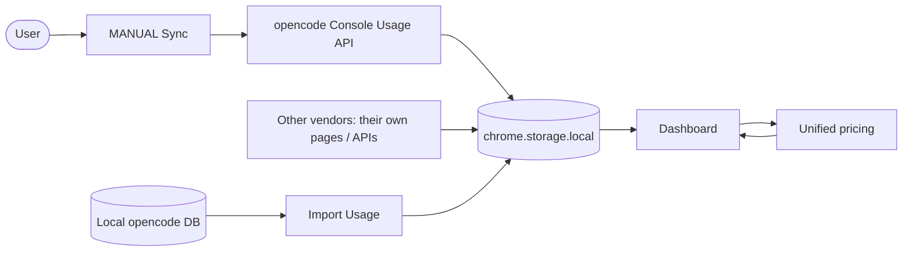

# Opencode Token Usage

A Chrome extension that aggregates token usage from several AI vendors into one local dashboard. opencode no longer scrapes its page — it syncs from the **Console Usage API** (one record per request, full history) using the signed-in Console session, so **no API key is stored**. The extension also tracks the free models opencode's own page ignores. OpenRouter, DeepSeek, CommandCode and MiMo can be enabled as well.

> **Syncing is MANUAL by default** — click **Sync** when you need fresh data, to avoid hitting vendors too frequently. opencode has an optional 6h auto-sync, which needs Chrome running with a signed-in opencode.ai session.

## Vendors

| Vendor | Mode | Import file | Default |
|---|---|---|---|
| opencode | sync (Console Usage API) | local DB JSON | on |
| OpenRouter | crawl (analytics) | — | off |
| DeepSeek | crawl (signed-in session) | — | off |
| CommandCode | crawl (charts) | — | off |
| MiMo | XLSX import | XLSX | off |

Enable more in **Settings → Vendors**. Each additional vendor may ask for host permission the first time you turn it on.

Only **opencode** and **MiMo** accept a vendor-native import file (opencode local DB JSON, MiMo XLSX). OpenRouter, DeepSeek and CommandCode have no export format to import — their records come from **Crawl Now**, or from a backup records CSV.

## Features

<table>
  <tr>
    <td align="center" width="33%">
      <strong>Free Models</strong> 
      Tracks free models ignored by the official page
    </td>
    <td align="center" width="33%">
      <strong>Full Usage</strong> 
      Charts, tables, unified pricing & backup export
    </td>
    <td align="center" width="33%">
      <strong>Peak Alerts</strong> 
      Peak / off-peak reminders with 24h timeline
    </td>
  </tr>
</table>

## Install

1. Clone/download this repo.
2. Open <kbd>chrome://extensions</kbd>, enable **Developer mode**.
3. **Remove any older install of this extension first.** Two copies would both crawl and double-count your usage.
4. Click **Load unpacked** and select the `extension` folder.

The manifest pins a stable extension ID (`key`), so after the first load you can move, re-clone or re-download the folder freely without losing your data.

## Upgrading from 0.8.x

This is a breaking release: multi-vendor support plus a unified price list. Read this before updating.

- **Your custom Rate Settings from 0.8.x are not carried over.** Costs fall back to the shipped price tables; edit them in **Settings → Pricing**.
- **Settings reset once on upgrade** — this release fixes the extension ID, which changes the storage namespace one time. You re-set: the peak-reminder toggle and model, workspace display names, enabled vendors, and default crawl vendor.
- **Your usage history is re-synced, not migrated.** opencode records now live in `chrome.storage.local` and are fetched from the Console Usage API. After loading the new version, open a signed-in `opencode.ai/console` page and click **Sync** (a full sync backfills all history).
- **Before updating**, use the old version's exports if you want a copy of anything; note the old CSV / rates formats are not importable by 1.0.0.
- **Local DB imports** (`tools/import-local.mjs`) are not stored on opencode.ai and are lost on the ID change — re-run the tool and Import again.

## Usage

1. Sign in at [opencode.ai](https://opencode.ai) and open a **Console** page — `https://opencode.ai/console` (it redirects to your workspace, e.g. `https://opencode.ai/console/<workspace-id>/usage`). The sync uses this signed-in session.
2. Click the extension icon → **Sync** to fetch the latest usage records. Syncing is intentionally MANUAL to avoid hitting vendors too frequently. Hold **Shift** for a **Full Sync** (re-fetches all history).
3. Click **Open Dashboard** to view charts, tables, and cost estimates.
4. **Export Backup** in the dashboard downloads two files: `opencode-usage_settings_*.json` (your settings + pricing) and `opencode-usage_records_*.csv` (every record, every source). **Import Usage** restores either file.
5. **Import Usage** accepts three file types, and one pick may mix them: `.xlsx` (MiMo export), `.json` (opencode local DB export, or a settings backup), `.csv` (backup records). Each file is routed by type, and a per-file failure does not abort the rest of the batch.

## How It Works

- **Sync (MANUAL):** open a signed-in `opencode.ai/console` page and click **Sync**. The extension calls the Console Usage API (`/console/api/usage/rows?range=all` — session cookie + `x-org-id`) for one record per request, paginated by cursor; hold **Shift** for a full-history sync. Other vendors sync from their own pages / APIs.
- **Pricing:** one user-authored price list (**Settings → Pricing**) bills every vendor; each model is mapped to a rate group and priced from tokens, so costs can be recomputed at any time.
- **Free models:** export from the local database and import the JSON on the dashboard.
- **View:** open **Dashboard** for charts, costs, and backup export.

Per-vendor detail (endpoints, fields, limits) lives in the dashboard's **Settings → How it works**, generated from each `vendor.json`, so it stays in sync with the adapters.

## Notes

- Syncing is MANUAL by default (click **Sync** each time); hold **Shift** for a Full Sync. opencode can optionally auto-sync every 6h (**Settings → Vendors → opencode**), but only while Chrome is open and you're signed in at opencode.ai — it reuses an open Console tab, or opens a background one and closes it once the sync ends.
- opencode reads its Console Usage API for the signed-in workspace (one record per request) and can backfill all history, so a manual sync only when you need fresh data is usually enough. It authenticates with the Console tab's session cookie; no API key is stored.
- Prices live in the dashboard's **Settings → Pricing** tab; **Settings → Database** lists every stored usage store and what can be deleted.
- The Rescan button is hidden by default; uncomment it in `popup/popup.html` and `popup/popup.js` to show it.

## License

MIT — see [`LICENSE`](LICENSE). Bundled third-party libraries keep their own licenses; see [`THIRD-PARTY-NOTICES.md`](THIRD-PARTY-NOTICES.md).
