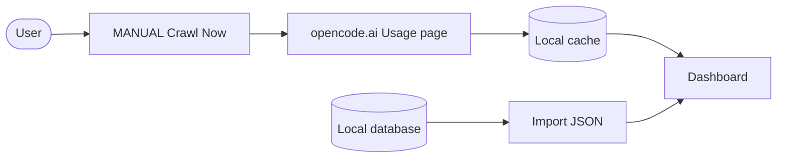

# Opencode Token Usage

[](https://github.com/xhang1108/opencode-usage)

A Chrome extension that syncs your [opencode.ai](https://opencode.ai) usage token data into local storage (OPFS) and shows it in a built-in dashboard. opencode's own usage page does not count free models, so this extension tracks them too.

opencode currently offers no public API for usage data, so crawling the Usage page you already have open is the only way to get cloud records. If you use the opencode CLI or local app, usage can instead come from the local database (see below).

> **Syncing is MANUAL** — click **Crawl Now** when you need fresh data. No auto-sync, to avoid hitting opencode.ai too frequently.

## Features

<table>
  <tr>
    <td align="center" width="33%">
      <strong>Free Models</strong><br>
      <sub>Tracks free models ignored by the official page</sub>
    </td>
    <td align="center" width="33%">
      <strong>Full Usage</strong><br>
      <sub>Charts, tables, rates & CSV export</sub>
    </td>
    <td align="center" width="33%">
      <strong>Peak Alerts</strong><br>
      <sub>Peak / off-peak reminders with 24h timeline</sub>
    </td>
  </tr>
</table>

## Install

1. Clone/download this repo.
2. Open <kbd>chrome://extensions</kbd>, enable **Developer mode**.
3. Click **Load unpacked** and select the `extension` folder.


## Usage

1. Sign in at [opencode.ai/auth](https://opencode.ai/auth) and open your workspace **Usage** page — `https://opencode.ai/workspace/<your-workspace-id>/usage`.
2. Click the extension icon → **Crawl Now** to sync the latest usage records. Syncing is intentionally MANUAL (no auto-sync) to avoid hitting opencode.ai too frequently.
3. Click **Open Dashboard** to view charts, tables, and cost estimates.
4. Use **Export Filtered Data (CSV)** on the dashboard to download records.

## How It Works



- **Sync (MANUAL):** open the Usage page, click **Crawl Now** to save records locally.
- **Free models:** export from the local database and import the JSON on the dashboard.
- **View:** open **Dashboard** for charts, costs, and CSV export.


## Local SQLite import (free models / CLI users)

opencode.ai no longer shows free-model usage, so crawling misses it. The local
database still has per-message tokens for every model — if you use the opencode
CLI or local app, this is where your usage already lives, no crawl needed.
Requires Node >= 22.5. The DB is read read-only, so it is safe while opencode runs.

```bash
node tools/import-local.mjs --out opencode_local_records.json
```

Options: `--db <path>` (default `~/.local/share/opencode/opencode.db`), `--workspace <name>` (default `Local`, single workspace for all local records).

Then open the dashboard → **Import Local JSON** and select the file. Local
records merge with crawled data under the **Local** workspace (the per-project
label is kept in each record's `project` field). Re-importing is safe.

## Notes

- Crawling is MANUAL (click **Crawl Now** each time); the extension refreshes the server ID itself. There is no background auto-sync on purpose — burst traffic has been observed to trigger rate limiting (HTTP 429) and throttling.
- Sync only when you need fresh data (e.g. once after a work session), not on a timer.
- Model rates can be edited in the dashboard's **Rate Settings**.
- The Rescan button is hidden by default; uncomment it in `popup/popup.html` and `popup/popup.js` to show it.
