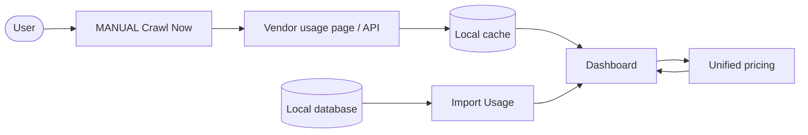

# Opencode Token Usage

[](https://github.com/xhang1108/opencode-usage)

A Chrome extension that aggregates token usage from several AI vendors into one local dashboard. opencode has no public usage API, so crawling the Usage page you already have open is the only way to get its cloud records; the extension also tracks the free models opencode's own page ignores. OpenRouter, DeepSeek, CommandCode and MiMo can be enabled as well.

> **Syncing is MANUAL** — click **Crawl Now** when you need fresh data. No auto-sync, to avoid hitting vendors too frequently.

## Vendors

| Vendor | Mode | Default |
|---|---|---|
| opencode | crawl (Usage page) | on |
| OpenRouter | crawl (analytics) | off |
| DeepSeek | crawl (API key) | off |
| CommandCode | crawl (charts) | off |
| MiMo | XLSX import | off |

Enable more in **Settings → Vendors**. Each additional vendor may ask for host permission the first time you turn it on.

## Features

<table>
  <tr>
    <td align="center" width="33%">
      <strong>Free Models</strong><br>
      <sub>Tracks free models ignored by the official page</sub>
    </td>
    <td align="center" width="33%">
      <strong>Full Usage</strong><br>
      <sub>Charts, tables, unified pricing & backup export</sub>
    </td>
    <td align="center" width="33%">
      <strong>Peak Alerts</strong><br>
      <sub>Peak / off-peak reminders with 24h timeline</sub>
    </td>
  </tr>
</table>

## Install

1. Clone/download this repo.
2. Open <kbd>chrome://extensions</kbd>, enable **Developer mode**.
3. **Remove any older install of this extension first.** Two copies would both crawl and double-count your usage.
4. Click **Load unpacked** and select the `extension` folder.

The manifest pins a stable extension ID (`key`), so after the first load you can move, re-clone or re-download the folder freely without losing your data.


## Upgrading from 0.8.x

This is a breaking release: multi-vendor support plus a unified price list. Read this before updating.

- **Your custom Rate Settings from 0.8.x are not carried over.** Costs fall back to the shipped price tables; edit them in **Settings → Pricing**.
- **Settings reset once on upgrade** — this release fixes the extension ID, which changes the storage namespace one time. You re-set: the peak-reminder toggle and model, workspace display names, enabled vendors, and default crawl vendor.
- **Your usage history is kept.** opencode crawl data lives in OPFS on the `opencode.ai` origin, independent of the extension ID. After loading the new version, open your opencode.ai Usage page and click **Crawl Now** — the history is rebuilt from the local cache.
- **Before updating**, use the old version's exports if you want a copy of anything; note the old CSV / rates formats are not importable by 1.0.0.
- **Local DB imports** (`tools/import-local.mjs`) are not stored on opencode.ai and are lost on the ID change — re-run the tool and Import again.

## Usage

1. Sign in at [opencode.ai/auth](https://opencode.ai/auth) and open your workspace **Usage** page — `https://opencode.ai/workspace/<your-workspace-id>/usage`.
2. Click the extension icon → **Crawl Now** to sync the latest usage records. Syncing is intentionally MANUAL to avoid hitting vendors too frequently.
3. Click **Open Dashboard** to view charts, tables, and cost estimates.
4. **Export Backup** in the dashboard downloads two files: `opencode-usage_settings_*.json` (your settings + pricing) and `opencode-usage_records_*.csv` (every record, every source). **Import Usage** restores either file.
5. **Import Usage** also accepts vendor exports (MiMo XLSX, opencode local JSON, DeepSeek/OpenRouter files).

## How It Works



- **Sync (MANUAL):** open a vendor's usage page, click **Crawl Now** to save records locally.
- **Pricing:** one user-authored price list (**Settings → Pricing**) bills every vendor; each model is mapped to a rate group and priced from tokens, so costs can be recomputed at any time.
- **Free models:** export from the local database and import the JSON on the dashboard.
- **View:** open **Dashboard** for charts, costs, and backup export.


## Local SQLite import (free models / CLI users)

opencode.ai no longer shows free-model usage, so crawling misses it. The local
database still has per-message tokens for every model — if you use the opencode
CLI or local app, this is where your usage already lives, no crawl needed.
Requires Node >= 22.5. The DB is read read-only, so it is safe while opencode runs.

```bash
node tools/import-local.mjs --out opencode_local_records.json
```

Options: `--db <path>` (default `~/.local/share/opencode/opencode.db`), `--workspace <name>` (default `Local`, single workspace for all local records).

Then open the dashboard → **Import Usage** and select the file. Local records
merge with crawled data under the **Local** workspace (the per-project label is
kept in each record's `project` field). Re-importing is safe. You can see and
clear imports under **Settings → Database**.

## Notes

- Crawling is MANUAL (click **Crawl Now** each time); the extension refreshes the server ID itself. There is no background auto-sync on purpose — burst traffic has been observed to trigger rate limiting (HTTP 429) and throttling.
- Sync only when you need fresh data (e.g. once after a work session), not on a timer.
- Prices live in the dashboard's **Settings → Pricing** tab; **Settings → Database** lists every stored usage store and what can be deleted.
- The Rescan button is hidden by default; uncomment it in `popup/popup.html` and `popup/popup.js` to show it.
