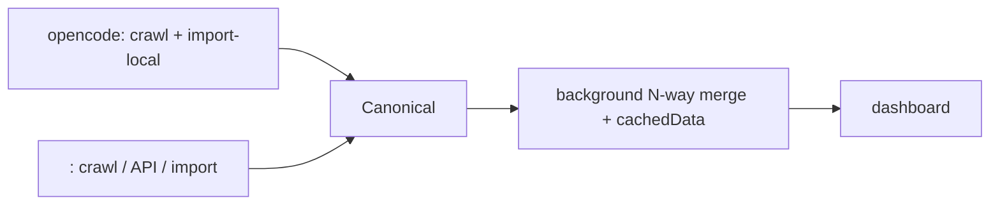

# 架構（architecture）

> 入口：`ROADMAP.md`（目標/原則/決策/里程碑）。廠商細節 `vendors.md`、驗證 `verification.md`、風險 `blindspots.md`。

## 1. 現況

* Crawl：`extension/content/content.js:778`、`crawl-worker.js:253`（已抓 `provider`）；OPFS `opencode_token_cache_<ws>.json`（`content.js:621`）+ lease（`crawl-worker.js:104`）。
* Local import：`tools/import-local.mjs`（無 `source`/`provider`）。
* 合併：`extension/background.js` `mergeRecords:344`、`sendDashboardData:610`、`hideCrawlerDuplicates:406`（fingerprint `383`）。
* 計費：`dashboard.js` `DEFAULT_MODEL_RATES:479`、`matchRule:795`（只比 model）、`getRecordCostAndSavings:890`、Rate Settings `1711-1857`。
* 顯示：`updateDropdowns:431`（workspace+model）、`exportFilteredCSV:1609`。

## 2. 目標：core + adapter



* Core（merge、dashboard、計費）vendor-neutral，只認 canonical。
* Adapter `raw → canonical`，每家獨立、獨立壞、獨立 clear。
* OPFS per-source 不統一；統一層只有 `chrome.storage.local.cachedData` + `globalCache`。

## 3. Canonical schema

```js
{
  id,          // "<source>:<orig-id>"（命名空間見 ROADMAP D4）
  source,      // "opencode" | "openrouter" | "deepseek-official" | "commandcode" | "mimo" | "manual"
  workspaceID, project, directory,
  time,        // ISO（UTC）
  date,        // YYYY-MM-DD（UTC；render 一律由 time 重算，不信此欄；現況 local，見 B3）
  model,       // 廠商原生名
  provider,
  input, output, reasoning, cacheRead, cacheWrite5m, cacheWrite1h,
  requests,    // optional
  sessionID, keyID, plan, costMultiplier,
  cacheBasis,  // optional: "derived" | "unknown"（廠商無原生 cache 拆分時）
  vendorCost,  // optional, opaque: 廠商回傳金額，僅供 cache token 反算/稽核，永不顯示或加總（D16）
  raw,         // optional, opaque: 廠商該筆原始 payload（去憑證）；記錄一切、永不顯示/加總（D18）
  tzOffset,    // optional: 廠商該列的 UTC offset（分鐘）；原始值在 raw，供稽核
  v: 1
}
```

* 驗證 `validateCanonical`：必填 `id/source/model/time` + 至少一 token > 0，缺則拒收；無 orig-id 時 adapter 生成穩定 hash。
* cache 欄必留；廠商沒拆分全進 `input` 並在該廠附錄註明（不估）。
* 廠商回傳金額（`vendorCost`）僅可作 cache token 反算與稽核；pricing/charts/tables/CSV/加總一律不得讀（D16），`cacheBasis` 記 derived/unknown。
* `raw`（D18）：adapter 把廠商回傳的**每個欄位**照存（含用不到的價格/成本/狀態），只剔除憑證；core 永不讀取或顯示，日後要補算才回頭用。
* `time` 一律 UTC；**顯示全部用 viewer local（含圖表）**（D19）。`id` 由**廠商原始欄位**生成（非轉換後時間），確保重匯同列 id 穩定、不重複。
* 無 `source` 舊記錄視為 `opencode`。

## 4. 計費

### 4.1 modelMap 查表（零搜名字）

```js
modelMap: { "<source>:<rawModel>": "<target-id>" }   // 撞 provider 才加一段：<source>:<provider>:<raw> 優先
targets:  { "<target-id>": { label, scope, rates: [...], curatedRates: [...] } }
```

* 命中 → target 計價；未命中 → `unmapped`，成本 0，進 inbox（不猜）。
* preset（`vendors/<source>/rates.preset.json`，含 map+targets）出貨；用戶決議存獨立 `userPricing` key 疊加，用戶勝。
* inbox：`unmappedFirstSeen` 記首見；Settings 常駐 badge（數 + 最久天數倒數）+ dashboard notice。

### 4.2 雙價與選擇

* `rates`（廠商原價，preset）/ `curatedRates`（我們或用戶定的價，可空）。
* `priceChoice: { <source>: "vendor" | "curated" }` 按廠商選，預設 curated；Models 分頁可按 target 覆寫。
* 選 curated 但沒設 → 保底用原廠價。
* 每筆標 `priceBasis`。
* free 變體（`*-free`）獨立 target，可顯示 0 或併主群；合併規則以後定。

### 4.3 版本鏈與公式

* 公式：`(input*ir + cacheRead*cr + cacheWrite*cw + (output+reasoning)*or)/1e6`，USD/1M（reasoning 按 output 價，D7）。
* `flat` / `peak|offpeak` / `tier` 語意不變；peak window UTC，各 target 自帶。
* 版本只加不減：preset 新 `from` 缺了 append，已有 `from` 不覆蓋，preset 刪版不刪用戶版。
* 改價作者制：price-watch 出候選，人合併進 preset；用戶改價走 Rates JSON 或 Models 視覺編輯（`userPricing`）。
* 禁止改歷史版本數字、禁止 bump 版本號推新價。
* 官價來源：見 `vendors.md` 各家表。

## 5. 儲存

* OPFS：per-origin，免命名空間（建議 `<source>_` 前綴 debug 用）。新 crawl 廠用自己的檔名 + lease；API/JSON 廠不用 OPFS。
* `chrome.storage.local`（唯一統一層）：
  * `cachedData` / `cachedMeta`：N-way 合併 snapshot（dashboard 唯一入口）。
  * `<source>ImportData` / `<source>ImportMeta`：各家匯入資料。
  * `vendorSettings`、`userPricing`、`crawlState` 等設定。
* dedupe（`hideCrawlerDuplicates`）只跑**同廠內部**：同一 `source` 的雙軌（crawl + 檔案）fingerprint 去重避免翻倍（opencode = crawler vs local、deepseek = crawl vs CSV）；fingerprint 加 `source`。
* 跨廠不自動去重（BYOK 等可能同筆用量兩家都記）。
* 全量備份：`Export Full JSON`；還原走各源 import。
* 預案：snapshot > 5MB 或變慢才按 source 拆 key（`raw` 會增加體積，見 D18）。

## 6. Dashboard 與 Crawl

* Settings 內嵌 dashboard 四分頁：General（default crawl）/ Vendors（開關 + priceChoice 粗調）/ Models（inbox + targets + 細調）/ Rates（JSON power 視圖，與 Models 雙向同步）。
* Vendor 開關 `vendorSettings`；新廠預設 off；新用戶 seed `{opencode:true}` + onboarding；舊用戶一次性提醒。
* Filter：Source / Provider / Model / Workspace / 日期（data-driven，只顯示 enabled 廠商值）。
* Table/CSV 加 `Source`、`priceBasis`、`requests`；chart 按 source 堆疊。
* Import：單一入口（拖放 / 選檔，可多檔），接受 JSON / ZIP / CSV / XLSX，自動分派各家 parser；**壓縮檔在 extension 內解壓**（ZIP + XLSX，D17）。
* Crawl：popup split-button，下拉只列 enabled；無 crawler 顯示 disabled；default crawl 由 General 設。
* 保留窗口提醒：接近各廠窗口（`vendors.md`）提示手動 crawl。

## 7. 新增廠商 SOP

1. 收驗證樣本 + 官價（`verification.md`）。
2. `extension/vendors/<source>/`：`vendor.json` + mapper + importer + `rates.preset.json`（+ crawl content-script 如需）。
3. registry（`shared/vendors.json`）加一行；background 動態載入。
4. manifest 由 `tools/build-manifest.mjs` 生成（M1 產物，尚不存在）。
5. 測試：import 兩次無重複、clear 不影響他廠、token 對帳通過、golden-file。
